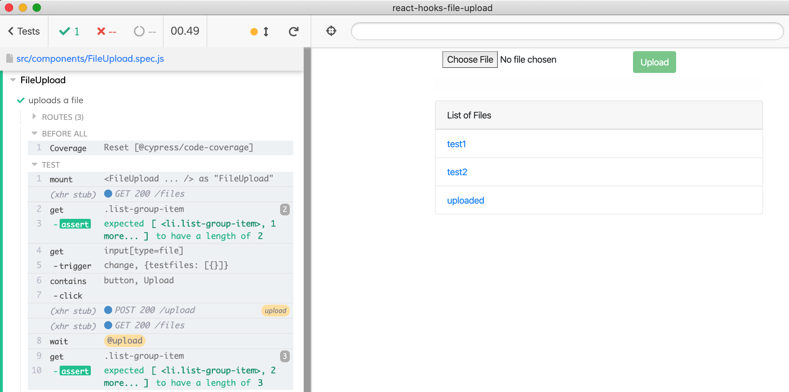

## React Hooks File Upload example with Axios & Boostrap

Shows how to upload a File by setting it in the React component during Cypress component test via [cypress-react-unit-test](https://github.com/bahmutov/cypress-react-unit-test).

See [src/components/FileUpload.spec.js](src/components/FileUpload.spec.js)



To run:

```
yarn
yarn cypress open
```

See also [File Upload in React](https://github.com/cypress-io/cypress-example-recipes#unit-testing) recipe.

Cloned from [bezkoder/react-hooks-file-upload](https://github.com/bezkoder/react-hooks-file-upload) described in [React Hooks File Upload example with Axios & Progress Bar](https://bezkoder.com/react-hooks-file-upload/).
